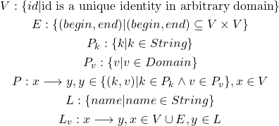

# TiGraph: Build a Graph Database on TiKV
[Project link](https://github.com/leiysky/tigraph)

## What is Graph Database?

### Preface

Hundreds of years ago, the city of Königsberg in Prussia devided into four parts by the Pregel River and connected with
seven bridges made Euler thinking about the Seven Bridges of Königsberg problem. After that, people started to concern
about the connection between *things*, and finally established Graph Theory.

There is always a connection, or relationship, to be common, between two arbitrary things in the world. We can use graph
 theory to analyze the relationships and learn from them, a good example is the Six Degrees of Seperation.

Graph Database is the tool for us to analyze relationships with computer.

With a Graph Database, we can store our data modeled in graph, and perform graph query on it.

### Graph Model

As we know, a graph is a set of nodes and relationships between nodes. Naturally, we represent data entity with node,
and represent connection between entities with relationship.

For example, let's say we have a data set of movies as follow:

- Wolf Warriors, directed by Jing Wu
- Wolf Warriors II, directed by Jing Wu
- The Wandering Earth, directed by Fan Guo

We can easily build a *Movie Grapg* graph with the principle we mentioned above.

> TODO: Image

This graph can represent the *direct* relationship between director and movies. However, we can notice that *Jing Wu* is
 not only director of *Wolf Warriors* and *Wolf Warriors II*, but also actor of both three movies.

To represent these relationships in *Movie Graph*, we introduce a concept of *Relationship Type*, or *Labeled Relationship*.

We can combine every relationship in the graph with a *Label*, to indicate which kind the relationship belongs to.

Take the actor relationship as example, we can add two kinds of labels: *Direct* and *Act*. And the graph will look like:

> TODO: Image

Now we have a graph with labeled relationships, this model is called *Edge-labeled Graph*.

We see that *Edge-labeled Graph* makes relationships more semantic, thus more information can be stored.

*Edge-labeled Graph* is the basis of semantic network, it provides a way to modeling connective data.

In real world, data is organized in *Structured* or *Semi-structured* format, which means each entity consists of a bunch of properties(fields). With the premise of that, we introduce *Property Graph*.

Above all, a *Property Grapg* is a *Edge-labeled Graph*. In a *Property Graph*, every node has a list of *Property* and a set of *Label*. A *Property* is a mapping from a string *Key* to a specified *Value*, and owned by a node. A *Label* is a specific string to indicate the kind of a node, and can be shared between multiple nodes. If there are arbitrary two nodes have a same *Label* L, we say they are both L node.

Here we give a formal definition of *Property Graph*:
<!---
\begin{gather*}
V: \{id|\text{id is a unique identity in arbitrary domain}\}
\\
E: \{(begin, end)|(begin, end) \subseteq V \times V \}
\\
P_k: \{k | k \in String\}
\\
P_v: \{v | v \in Domain\}
\\
P: x \longrightarrow y, y \in \{(k, v) | k \in P_k \land v \in P_v \}, x \in V
\\
L: \{name | name \in String \}
\\
L_v: x \longrightarrow y, x \in V \cup E, y \in L
\end{gather*}
--->


### Graph Query

We use *Graph Query Language* to describe a query on our *Property Graph*.

A graph query will solve a problem like:

- Subgraph isomorphism problem
- Path navigation
- Grapg data aggregation

To help solving the problems, we introduce a concept of *Graph Pattern*, for describing the pattern of target data set.

*Cypher* is a *Graph Query Language* introduced by [Neo4j](https://neo4j.com/), which takes *Graph Pattern* as its core concept.

For the movies case mentioned in Section [Graph Model](#graph-model), let's say we want *all movies directed by Jing Wu*, we can write a query in *Cypher* like:

```cypher
MATCH (a:DIRECTOR)-[:direct]->(b:MOVIE)
WHERE a.name = "Jing Wu"
RETURN b
```

In this query, there is a *Graph Pattern* describing our *movies directed by Jing Wu* data set: `(a:DIRECTOR)-[:direct]->(b:MOVIE)`.

In this patten, variables quoted with parentheses indicate *node*, and *relationship* are indicated by that quoted by square brackets.

It says: 
> we want to find all paths match the pattern that there is a *node* with label `DIRECTOR` binds to `a`, a *node* with label `MOVIE` binds to `b`, and there is a relationship between them with direction from `a` to `b` and label `direct`.


## How to implement?

### Extend of Relation Algebra

